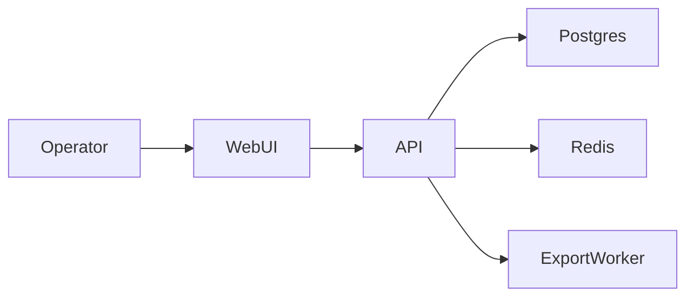

## Planning Summary

Build a modular monolith with a React dashboard, FastAPI API layer, PostgreSQL,
Redis rate limit counters, and explicit audit tables. Authentication,
authorization, input validation, rate limit checks, audit logging, and secret
redaction are enforced before any tenant mutation leaves the service layer.

## Architecture Overview

## Requirement Traceability Matrix

| Source ID | Requirement summary | Design response | Verification method | Residual risk |
|---|---|---|---|---|
| FR-001 | Create tenant. | POST /tenants with service validation. | contract create test | Low |
| FR-002 | Update plan. | PATCH /tenants/{id}/plan with owner policy. | authorization test | Low |
| FR-003 | Adjust credits. | Idempotent ledger command. | concurrency test | Medium |
| FR-004 | Export records. | Export worker redacts secret fields. | export redaction test | Low |
| NFR-001 | p95 450 ms. | Indexed tenant queries and bounded joins. | load test | Medium |
| NFR-002 | Audit retention 365 days. | Audit retention job preserves rows for the required window. | retention test | Low |
| SEC-001 | Auth and authz. | JWT middleware plus tenant policy. | 401 and 403 tests | Low |
| SEC-002 | Input validation. | Pydantic schemas at API boundary. | validation test | Low |
| SEC-003 | Rate limit. | Redis sliding window per actor. | 429 test | Low |
| SEC-004 | Audit and secrets. | Audit table stores redacted payload. | audit redaction test | Low |

## Technology Stack and Rationale

| Layer | Choice | Version (latest stable as of YYYY-MM) | Support status | EOL date | Why not the next-best alternative |
|---|---|---|---|---|---|
| language | Python | 3.12 as of 2026-05 | Active | 2028-10 | Strong FastAPI ecosystem. |
| framework | FastAPI | 0.124 as of 2026-05 | Active | None announced | Lower ceremony than Django for APIs. |
| frontend framework | React | 19 as of 2026-05 | Active | None announced | Broader hiring pool than Svelte. |
| cache | Redis | 7 as of 2026-05 | Active | None announced | Simpler rate limit primitive than Memcached. |

## Data Model and Persistence

| Entity | Fields | Security stance |
|---|---|---|
| Tenant | id, name, plan, owner_user_id | tenant_id indexed for authorization |
| CreditLedger | id, tenant_id, delta, reason, idempotency_key | append-only audit |
| AuditEvent | id, actor_id, tenant_id, action, redacted_payload | secret fields masked |

## API Design

| Endpoint | Method | Requirement | Security control |
|---|---|---|---|
| /tenants | POST | FR-001 | authentication, authorization, input validation, rate limit |
| /tenants/{id}/plan | PATCH | FR-002 | tenant policy and audit |
| /tenants/{id}/credits | POST | FR-003 | idempotency key and audit |
| /tenants/{id}/export | POST | FR-004 | redaction worker and rate limit |

## Security Architecture

SEC-001 is enforced by JWT authentication middleware and tenant-scoped
authorization policies. SEC-002 is enforced by request schemas. SEC-003 is
enforced by Redis rate limit counters. SEC-004 is enforced by redaction helpers
before audit and export writes. Secret values are never logged.

## Frontend Architecture

React routes use server-state queries with explicit loading, error, empty, and
offline states. Forms validate client-side before API input validation. Keyboard
focus returns to the triggering button after dialogs close. The dashboard uses
WCAG AA semantics and an axe-core regression test.

## Capacity Model

| Flow | Target RPS | Latency budget | Data growth | Read/write ratio | 10x stress projection | 100x stress projection |
|---|---|---|---|---|---|---|
| tenant list | 40 steady, 120 peak | p95 450 ms, p99 900 ms | 1k rows/day | 20:1 | Postgres CPU breaks first | add read replica and cursor partition |
| credit adjust | 8 steady, 30 peak | p95 500 ms, p99 1000 ms | 5k rows/day | 1:3 | ledger index contention | queue writes with exactly-once worker |

## Threat Model (STRIDE)

| Boundary | Spoofing | Tampering | Repudiation | Information disclosure | Denial of service | Elevation of privilege |
|---|---|---|---|---|---|---|
| WebUI to API | JWT check SEC-001 | schema validation SEC-002 | audit SEC-004 | redaction SEC-004 | rate limit SEC-003 | tenant policy SEC-001 |

## SLOs and Error Budgets

| Service | Availability | Latency | Correctness | Error budget | Paging |
|---|---|---|---|---|---|
| tenant API | 99.9 percent monthly | p95 450 ms | 99.99 percent no double-credit | 43 minutes monthly | page on 5xx burn above 2 percent |

## Failure Mode and Effects Analysis

| Failure mode | Detection | Blast radius | Mitigation | Recovery time | Customer impact |
|---|---|---|---|---|---|
| Redis unavailable | health metric | rate limit degraded | local deny-after-threshold fallback | 10 minutes | fewer exports allowed |
| Postgres primary slow | p95 alert | tenant writes delayed | connection pool shedding | 20 minutes | support sees retry message |

## Architecture Quality Attribute Matrix

| Component | Performance stance | Scalability stance | Reliability stance | Security stance | Maintainability stance |
|---|---|---|---|---|---|
| API | indexed queries | horizontal workers | retries at worker edge | authz policy | service modules |
| WebUI | cached queries | route code split | retryable fetches | no secret storage | shared form primitives |

## Architecture Decision Records

### ADR-001 Modular monolith
- Decision: Use a modular monolith with clear service boundaries.
- Forces: FR-001, FR-002, SEC-001, small team size.
- Options Considered: modular monolith, microservices.
- Chosen + WHY-not-next-best: monolith avoids distributed coupling before scale.
- Reversal Cost: Medium because modules can later split by bounded context.

### ADR-002 Append-only credit ledger
- Decision: Store credit changes as append-only ledger rows.
- Forces: FR-003, SEC-004.
- Options Considered: mutable balance column, append-only ledger.
- Chosen + WHY-not-next-best: ledger preserves audit evidence.
- Reversal Cost: Low because balance reads can project from ledger.

### ADR-003 Redis rate limit
- Decision: Use Redis sliding windows for mutation rate limits.
- Forces: SEC-003, NFR-001.
- Options Considered: in-process counters, Redis counters.
- Chosen + WHY-not-next-best: Redis works across workers.
- Reversal Cost: Low because middleware owns the integration.

### ADR-004 Worker export path
- Decision: Run exports through a background worker.
- Forces: FR-004, SEC-004.
- Options Considered: synchronous export, worker export.
- Chosen + WHY-not-next-best: worker isolates redaction and latency.
- Reversal Cost: Medium because clients already poll export status.

### ADR-005 React dashboard
- Decision: Use React with server-state query caching.
- Forces: FR-001, FR-002, NFR-001.
- Options Considered: React, server-rendered templates.
- Chosen + WHY-not-next-best: React supports dense operator workflows.
- Reversal Cost: High because route and state contracts would change.

## Architecture Anti-Patterns

- Microservices below product-market fit are rejected because ADR-001 keeps one deploy.
- Distributed monolith is rejected because modules cannot share hidden databases.
- Premature sharding is rejected until the Capacity Model 100x point.
- Dual-write without outbox is rejected for credit and audit writes.
- Business rules in routers are rejected; services own policies.
- Sync external calls in the request path are rejected for exports.
- N+1 patterns require eager-load or batch strategy per relation.
- Polling is used only for export status; realtime channels are unnecessary here.

## Multi-tenancy Stance

Use shared-schema plus tenant_id columns by default. SEC-001 requires tenant
authorization on every query, and current isolation needs do not justify
schema-per-tenant or physical isolation.
