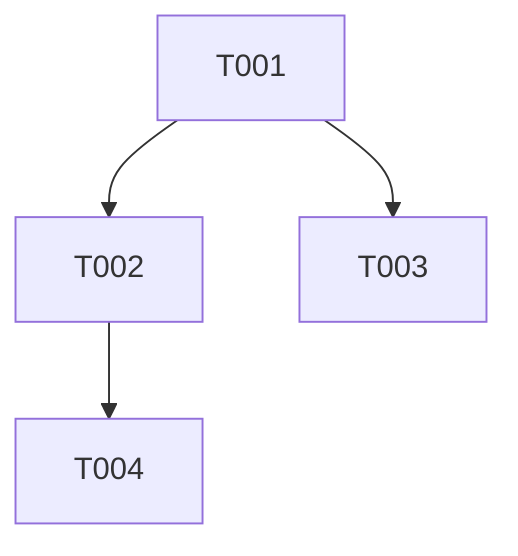

## Effort Summary

- Estimate range: ~2 weeks
- Tasks: 4 total - 4 MUST - 0 SHOULD - 0 COULD
- Sizes: 2xM - 2xS
- Minimum cut: Ship MUST-only -> ~8d

## Execution Overview

Implement the tenant model, service policies, API routes, and export worker in
that order. Each task preserves authentication, authorization, input validation,
rate limit controls, audit logging, and secret redaction.

## Traceability Overview

| Source ID | Plan section | Harness tests | Task IDs | Completion evidence |
|---|---|---|---|---|
| FR-001 | API Design | test_create_tenant | T-001 | contract test passes |
| FR-002 | API Design | test_update_plan_requires_authorization | T-002 | security test passes |
| FR-003 | Data Model and Persistence | test_credit_adjustment_idempotent | T-003 | concurrency test passes |
| FR-004 | API Design | test_export_redacts_secret_fields | T-004 | redaction test passes |
| NFR-001 | Capacity Model | load test | T-001 | latency evidence |
| NFR-002 | Data Model and Persistence | test_audit_retention_preserves_active_rows | T-002 | retention evidence |
| SEC-001 | Security Architecture | test_update_plan_requires_authorization | T-002 | authz evidence |
| SEC-002 | Security Architecture | test_create_tenant_rejects_bad_name | T-001 | validation evidence |
| SEC-003 | Security Architecture | test_export_rate_limit | T-004 | rate limit evidence |
| SEC-004 | Security Architecture | test_plan_change_writes_audit_event | T-002 | audit evidence |

## Dependency Graph

## Task Sizing Legend

S means one focused day or less. M means one to three focused days with tests.

## Phase 1: Data Layer

### T-001: Create Tenant Model And Create Endpoint

**Spec refs:** FR-001, NFR-001, SEC-002
**Plan refs:** Data Model and Persistence, API Design
**Harness refs:** tests/contract/test_tenants.py::test_create_tenant
**Priority:** MUST
**Estimate:** M

Create the tenant table, request schema, and POST /tenants route with input
validation and audit-safe logging. Acceptance: pytest test_create_tenant and
test_create_tenant_rejects_bad_name pass.

## Phase 2: API Layer

### T-002: Add Plan Update Authorization And Audit Event

**Spec refs:** FR-002, NFR-002, SEC-001, SEC-004
**Plan refs:** Security Architecture, API Design
**Harness refs:** tests/contract/test_tenants.py::test_update_plan_requires_authorization
**Priority:** MUST
**Estimate:** M

Implement tenant-scoped authorization for plan changes and write the redacted
audit event. Acceptance: pytest test_update_plan_requires_authorization and
test_plan_change_writes_audit_event pass.

### T-003: Implement Idempotent Credit Adjustments

**Spec refs:** FR-003, SEC-004
**Plan refs:** Data Model and Persistence
**Harness refs:** tests/integration/test_credits.py::test_credit_adjustment_idempotent
**Priority:** MUST
**Estimate:** S

Add an idempotent ledger command keyed by tenant and idempotency key. Acceptance:
pytest test_credit_adjustment_idempotent passes and audit rows retain reasons.

### T-004: Implement Export Worker With Rate Limit

**Spec refs:** FR-004, SEC-003, SEC-004
**Plan refs:** API Design, Security Architecture
**Harness refs:** tests/security/test_exports.py::test_export_redacts_secret_fields
**Priority:** MUST
**Estimate:** S

Create the export route and worker redaction path. Acceptance: pytest
test_export_redacts_secret_fields and test_export_rate_limit pass with no
secret-shaped strings in output.
