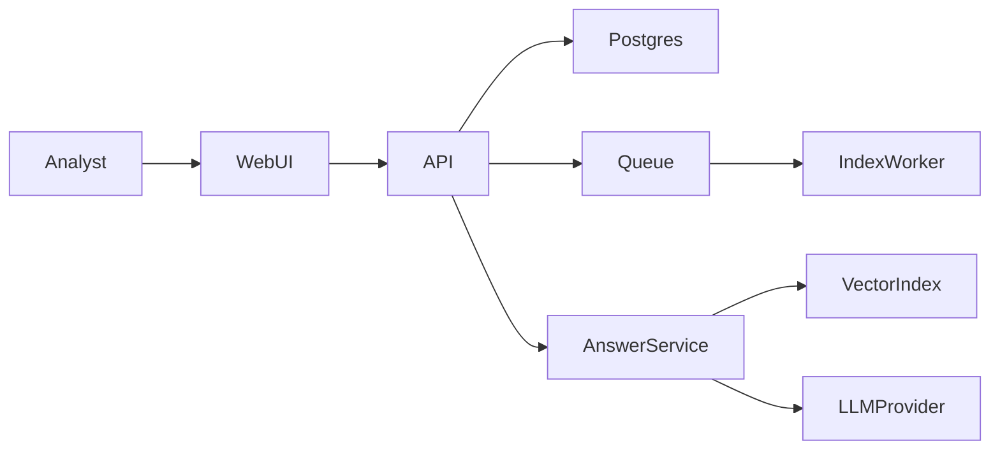

## Planning Summary

Build a modular monolith with a document ingestion worker, vector index, answer
service, and reviewer queue. LLM-facing inputs are wrapped as untrusted content.
Authentication, authorization, input validation, rate limit checks, audit logging,
and secret redaction run before the model call and after the model output.

## Architecture Overview

## Requirement Traceability Matrix

| Source ID | Requirement summary | Design response | Verification method | Residual risk |
|---|---|---|---|---|
| FR-001 | Upload documents. | POST /documents plus indexing worker. | upload contract test | Low |
| FR-002 | Answer with citations. | Retrieval service requires chunk citations. | answer citation test | Medium |
| FR-003 | Flag response. | Review queue table and API route. | review queue test | Low |
| FR-004 | Delete documents. | Cascading document and embedding delete. | delete test | Low |
| NFR-001 | Answer latency. | Cached retrieval and bounded context. | latency test | Medium |
| SEC-001 | Auth and authz. | Tenant policy on document IDs. | isolation test | Low |
| SEC-002 | Input validation. | File type and size validators. | upload validation test | Low |
| SEC-003 | Prompt injection. | Untrusted content wrapper and output validator. | hostile fixture test | Medium |
| SEC-004 | Secret redaction. | Redaction before answer and audit writes. | secret scan test | Low |
| SEC-005 | Rate limit. | Redis windows per route. | rate limit test | Low |

## Technology Stack and Rationale

| Layer | Choice | Version (latest stable as of YYYY-MM) | Support status | EOL date | Why not the next-best alternative |
|---|---|---|---|---|---|
| language | Python | 3.12 as of 2026-05 | Active | 2028-10 | Async workers and API share types. |
| framework | FastAPI | 0.124 as of 2026-05 | Active | None announced | Clear request validation. |
| queue | Redis streams | 7 as of 2026-05 | Active | None announced | Simpler than Kafka for V1. |
| LLM provider | OpenAI GPT-4o Mini | 2026-05 stable | Active | None announced | Lower cost than frontier model for citations. |
| frontend framework | React | 19 as of 2026-05 | Active | None announced | Mature accessible UI ecosystem. |

## Data Model and Persistence

| Entity | Fields | Security stance |
|---|---|---|
| Document | id, tenant_id, status, filename, content_hash | tenant-scoped authorization |
| Chunk | id, document_id, text_hash, citation_label | text treated as untrusted content |
| Answer | id, question, answer_text, citations, redaction_status | secret scan before storage |
| ReviewFlag | id, answer_id, reason, actor_id | audit trail required |

## API Design

| Endpoint | Method | Requirement | Security control |
|---|---|---|---|
| /documents | POST | FR-001 | authentication, authorization, input validation, rate limit |
| /questions | POST | FR-002 | untrusted content wrapper and output validation |
| /answers/{id}/flags | POST | FR-003 | audit logging |
| /documents/{id} | DELETE | FR-004 | tenant policy and cascade guard |

## Security Architecture

SEC-001 uses JWT authentication and document ownership authorization. SEC-002
uses upload input validation. SEC-003 uses untrusted content wrappers, prompt
injection fixtures, and a model output validator. SEC-004 applies secret redaction
before answers and audit events are stored. SEC-005 uses Redis rate limit windows.

## Prompt and AI Safety Controls

All document chunks are untrusted content. The answer service separates system
instructions from retrieval data, refuses role-change instructions inside
documents, requires citations, and runs output validation for secret-shaped text.

## Frontend Architecture

The React app has upload, search, answer, and review screens. Each screen defines
loading, error, empty, and offline states. Focus moves to answer results after a
question completes and returns to the question box after flagging.

## Capacity Model

| Flow | Target RPS | Latency budget | Data growth | Read/write ratio | 10x stress projection | 100x stress projection |
|---|---|---|---|---|---|---|
| ask question | 10 steady, 45 peak | p95 2500 ms, p99 5000 ms | 50k chunks/day | 30:1 | vector index latency rises | shard index by tenant |
| upload document | 3 steady, 12 peak | p95 800 ms, p99 1600 ms | 1k docs/day | 1:5 | queue depth grows | split indexing workers |

## Threat Model (STRIDE)

| Boundary | Spoofing | Tampering | Repudiation | Information disclosure | Denial of service | Elevation of privilege |
|---|---|---|---|---|---|---|
| WebUI to API | JWT SEC-001 | schema validation SEC-002 | audit SEC-004 | tenant filter SEC-001 | rate limit SEC-005 | role policy SEC-001 |
| Retrieval to LLM | provider key isolation SEC-004 | signed context SEC-003 | generation audit SEC-004 | redaction SEC-004 | budget cap SEC-005 | instruction hierarchy SEC-003 |

## SLOs and Error Budgets

| Service | Availability | Latency | Correctness | Error budget | Paging |
|---|---|---|---|---|---|
| answer API | 99.5 percent monthly | p95 2500 ms | 99 percent cited answers | 216 minutes monthly | page when cited answers fall below 98 percent |
| indexing worker | 99 percent monthly | p95 800 ms enqueue | 99.9 percent eventually indexed | 432 minutes monthly | ticket on retry backlog over 100 |

## Failure Mode and Effects Analysis

| Failure mode | Detection | Blast radius | Mitigation | Recovery time | Customer impact |
|---|---|---|---|---|---|
| LLM provider timeout | timeout metric | answer route only | retry once then graceful error | 5 minutes | user retries later |
| vector index stale | freshness metric | search quality | reindex affected document | 30 minutes | citations may be delayed |
| queue unavailable | health alert | uploads wait | store pending state in database | 15 minutes | indexing delayed |

## Architecture Quality Attribute Matrix

| Component | Performance stance | Scalability stance | Reliability stance | Security stance | Maintainability stance |
|---|---|---|---|---|---|
| AnswerService | bounded context | per-tenant index | retry with timeout | untrusted content wrapper | citation contract |
| IndexWorker | batch chunks | horizontal workers | retry queue | file validation | isolated pipeline |

## Architecture Decision Records

### ADR-001 Retrieval augmented generation
- Decision: Use retrieval augmented generation with mandatory citations.
- Forces: FR-002, SEC-003.
- Options Considered: direct LLM answer, retrieval augmented generation.
- Chosen + WHY-not-next-best: citations make answer evidence auditable.
- Reversal Cost: Medium because answer contracts depend on citations.

### ADR-002 Redis stream indexing
- Decision: Use Redis streams for indexing jobs.
- Forces: FR-001, NFR-002.
- Options Considered: synchronous indexing, Redis streams.
- Chosen + WHY-not-next-best: streams recover transient provider failures.
- Reversal Cost: Low because job payloads are compact.

### ADR-003 Output validation gate
- Decision: Validate model output before storage.
- Forces: SEC-003, SEC-004.
- Options Considered: trust provider safety, local validator.
- Chosen + WHY-not-next-best: local validator catches secret-shaped text.
- Reversal Cost: Low because it is a service boundary.

### ADR-004 Tenant vector partition
- Decision: Partition vector search by tenant.
- Forces: SEC-001, NFR-001.
- Options Considered: shared global index, tenant partition.
- Chosen + WHY-not-next-best: partition enforces authorization at retrieval.
- Reversal Cost: Medium because reindexing is required.

### ADR-005 Review queue
- Decision: Store answer flags in a review queue.
- Forces: FR-003, SEC-004.
- Options Considered: email-only flags, durable review queue.
- Chosen + WHY-not-next-best: durable rows support audit and reporting.
- Reversal Cost: Low because flags are isolated.

## Architecture Anti-Patterns

- Microservices below product-market fit are rejected for V1.
- Distributed monolith is rejected because API and workers share one schema by contract.
- Premature sharding is rejected until vector search hits 100x projection.
- Dual-write without outbox is rejected for answer and audit writes.
- Business rules in routers are rejected; services own prompt safety controls.
- Sync external calls in the request path use timeouts and circuit breakers.
- N+1 patterns require batch loading document chunks.
- Polling is limited to indexing status; SSE can be added if users need live updates.

## Multi-tenancy Stance

Use shared-schema plus tenant_id columns. SEC-001 drives tenant filtering across
documents, chunks, answers, and review flags.
