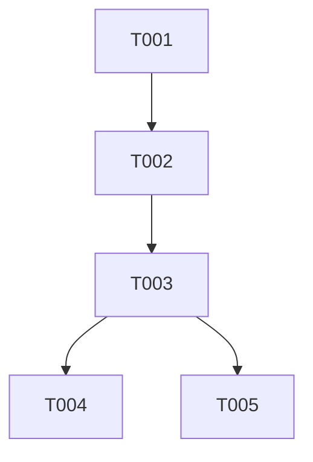

## Effort Summary

- Estimate range: ~3 weeks
- Tasks: 5 total - 5 MUST - 0 SHOULD - 0 COULD
- Sizes: 3xM - 2xS
- Minimum cut: Ship MUST-only -> ~12d

## Execution Overview

Implement document storage, indexing, answer generation, safety validation, and
review workflow. Every task preserves authentication, authorization, input
validation, rate limit controls, audit logging, secret redaction, and untrusted
content handling for LLM-facing inputs.

## Traceability Overview

| Source ID | Plan section | Harness tests | Task IDs | Completion evidence |
|---|---|---|---|---|
| FR-001 | API Design | test_upload_document_indexes | T-001 | upload test passes |
| FR-002 | Prompt and AI Safety Controls | test_answer_requires_citations | T-003 | answer test passes |
| FR-003 | Data Model and Persistence | test_flag_answer_creates_review_row | T-004 | review test passes |
| FR-004 | API Design | test_delete_document_removes_embeddings | T-005 | delete test passes |
| SEC-001 | Security Architecture | test_document_cross_tenant_forbidden | T-002 | isolation test passes |
| SEC-002 | Security Architecture | test_upload_rejects_unsafe_file | T-001 | validation test passes |
| SEC-003 | Prompt and AI Safety Controls | test_untrusted_content_cannot_override_instructions | T-003 | safety test passes |
| SEC-004 | Security Architecture | test_answer_redacts_secret_shaped_text | T-003 | redaction test passes |
| SEC-005 | Security Architecture | test_question_rate_limit | T-003 | rate limit test passes |

## Dependency Graph

## Task Sizing Legend

S means one focused day or less. M means one to three focused days with tests.

## Phase 1: Data Layer

### T-001: Implement Document Upload And Validation

**Spec refs:** FR-001, SEC-002
**Plan refs:** API Design, Data Model and Persistence
**Harness refs:** tests/contract/test_documents.py::test_upload_document_indexes
**Priority:** MUST
**Estimate:** M

Create document records and upload input validation. Acceptance: pytest
test_upload_document_indexes and test_upload_rejects_unsafe_file pass.

### T-002: Enforce Tenant Authorization For Documents

**Spec refs:** SEC-001
**Plan refs:** Security Architecture
**Harness refs:** tests/security/test_isolation.py::test_document_cross_tenant_forbidden
**Priority:** MUST
**Estimate:** S

Add tenant-scoped authorization to document reads and writes. Acceptance: pytest
test_document_cross_tenant_forbidden passes.

## Phase 2: AI Safety

### T-003: Implement Cited Answer Service And Safety Gate

**Spec refs:** FR-002, SEC-003, SEC-004, SEC-005
**Plan refs:** Prompt and AI Safety Controls
**Harness refs:** tests/contract/test_answers.py::test_answer_requires_citations
**Priority:** MUST
**Estimate:** M

Build retrieval, answer generation, untrusted content containment, output
validation, rate limit controls, audit logging, and secret redaction. Acceptance:
pytest test_answer_requires_citations and test_answer_redacts_secret_shaped_text pass.

### T-004: Add Answer Review Flags

**Spec refs:** FR-003, SEC-004
**Plan refs:** Data Model and Persistence
**Harness refs:** tests/integration/test_review.py::test_flag_answer_creates_review_row
**Priority:** MUST
**Estimate:** S

Create review flag storage and audit events. Acceptance: pytest
test_flag_answer_creates_review_row passes.

### T-005: Delete Documents And Embeddings

**Spec refs:** FR-004
**Plan refs:** API Design
**Harness refs:** tests/integration/test_documents.py::test_delete_document_removes_embeddings
**Priority:** MUST
**Estimate:** M

Implement document deletion and embedding cleanup. Acceptance: pytest
test_delete_document_removes_embeddings passes.
