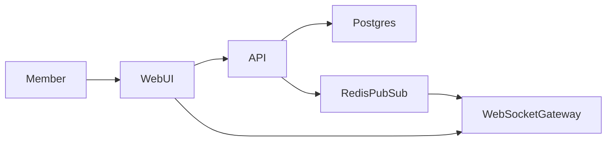

## Planning Summary

Build a modular monolith with REST card commands, a WebSocket event gateway,
PostgreSQL event log, Redis pub/sub fanout, and replay by sequence number.
Authentication, authorization, input validation, rate limit checks, audit logging,
and secret redaction run on both REST and realtime paths.

## Architecture Overview

## Requirement Traceability Matrix

| Source ID | Requirement summary | Design response | Verification method | Residual risk |
|---|---|---|---|---|
| FR-001 | Create card. | POST /boards/{id}/cards writes card and event. | create card test | Low |
| FR-002 | Move card live. | Move command publishes ordered event. | broadcast test | Medium |
| FR-003 | Reconnect replay. | GET replay after sequence. | replay test | Medium |
| FR-004 | Archive card. | Archive flag plus audit event. | archive test | Low |
| NFR-001 | p95 300 ms event. | Redis fanout and small payloads. | realtime latency test | Medium |
| NFR-002 | 10k events/day. | indexed board sequence. | load test | Low |
| SEC-001 | Auth and authz. | board membership policy. | cross-board test | Low |
| SEC-002 | Input validation. | schema validation. | validation test | Low |
| SEC-003 | Rate limit. | Redis counters. | reconnect rate test | Low |
| SEC-004 | Audit. | event log and audit row. | audit test | Low |
| SEC-005 | Secret redaction. | payload sanitizer. | redaction test | Low |

## Technology Stack and Rationale

| Layer | Choice | Version (latest stable as of YYYY-MM) | Support status | EOL date | Why not the next-best alternative |
|---|---|---|---|---|---|
| language | Python | 3.12 as of 2026-05 | Active | 2028-10 | Async WebSocket support. |
| framework | FastAPI | 0.124 as of 2026-05 | Active | None announced | Native WebSocket handling. |
| queue | Redis pub/sub | 7 as of 2026-05 | Active | None announced | Lower operation cost than Kafka for V1. |
| frontend framework | React | 19 as of 2026-05 | Active | None announced | Strong board UI ecosystem. |

## Data Model and Persistence

| Entity | Fields | Security stance |
|---|---|---|
| Board | id, tenant_id, name | board authorization |
| Card | id, board_id, column_id, title, archived_at | input validation |
| BoardEvent | id, board_id, sequence, type, payload | append-only audit |
| AuditEvent | id, actor_id, board_id, action, redacted_payload | secret redaction |

## API Design

| Endpoint | Method | Requirement | Security control |
|---|---|---|---|
| /boards/{id}/cards | POST | FR-001 | authentication, authorization, input validation, rate limit |
| /boards/{id}/cards/{card_id}/move | POST | FR-002 | sequence lock and audit |
| /boards/{id}/events | GET | FR-003 | replay authorization and rate limit |
| /boards/{id}/cards/{card_id}/archive | POST | FR-004 | audit and redaction |
| /ws/boards/{id} | WebSocket | FR-002 | authenticated board session |

## Security Architecture

SEC-001 is enforced by authenticated sessions and board membership
authorization. SEC-002 is enforced by command schemas. SEC-003 uses Redis rate
limit counters. SEC-004 stores immutable audit events. SEC-005 sanitizes secret
fields before logs, audit rows, and realtime payloads.

## Frontend Architecture

The React board uses optimistic updates guarded by server sequence numbers. It
renders loading, error, empty, and offline states. Keyboard users can move cards
with focused controls, and an axe-core test covers the board route.

## Capacity Model

| Flow | Target RPS | Latency budget | Data growth | Read/write ratio | 10x stress projection | 100x stress projection |
|---|---|---|---|---|---|---|
| move card | 80 steady, 300 peak | p95 300 ms, p99 700 ms | 10k events/day | 4:1 | Redis fanout CPU rises | partition channels by board |
| replay events | 20 steady, 100 peak | p95 500 ms, p99 1000 ms | 10k rows/day | 30:1 | board_event index grows | cold archive old events |

## Threat Model (STRIDE)

| Boundary | Spoofing | Tampering | Repudiation | Information disclosure | Denial of service | Elevation of privilege |
|---|---|---|---|---|---|---|
| WebUI to API | session SEC-001 | input validation SEC-002 | audit SEC-004 | board filter SEC-001 | rate limit SEC-003 | membership policy SEC-001 |
| API to WebSocket | signed session SEC-001 | sequence check SEC-002 | event log SEC-004 | payload redaction SEC-005 | connection cap SEC-003 | board join policy SEC-001 |

## SLOs and Error Budgets

| Service | Availability | Latency | Correctness | Error budget | Paging |
|---|---|---|---|---|---|
| board API | 99.9 percent monthly | p95 300 ms move | 99.99 percent ordered events | 43 minutes monthly | page on ordering errors |
| WebSocket gateway | 99.5 percent monthly | p95 300 ms fanout | 99.9 percent delivery while connected | 216 minutes monthly | page on disconnect spike |

## Failure Mode and Effects Analysis

| Failure mode | Detection | Blast radius | Mitigation | Recovery time | Customer impact |
|---|---|---|---|---|---|
| Redis pub/sub down | health alert | live updates delayed | clients replay from database | 10 minutes | users reconnect to catch up |
| WebSocket gateway restart | disconnect metric | active board sessions | exponential reconnect with sequence | 5 minutes | brief offline state |
| Postgres slow | latency alert | commands delayed | reject writes after timeout | 20 minutes | move retry message |

## Architecture Quality Attribute Matrix

| Component | Performance stance | Scalability stance | Reliability stance | Security stance | Maintainability stance |
|---|---|---|---|---|---|
| API | small command payloads | horizontal workers | transaction sequence lock | authz policies | command handlers |
| WebSocketGateway | small event payloads | board channels | replay recovery | session auth | isolated gateway |

## Architecture Decision Records

### ADR-001 Event log as source for replay
- Decision: Store every board event with a monotonic sequence.
- Forces: FR-002, FR-003, SEC-004.
- Options Considered: ephemeral pub/sub only, persisted event log.
- Chosen + WHY-not-next-best: persisted log enables replay and audit.
- Reversal Cost: Medium because clients rely on sequence numbers.

### ADR-002 Redis fanout
- Decision: Use Redis pub/sub for board event fanout.
- Forces: NFR-001, FR-002.
- Options Considered: database polling, Redis pub/sub.
- Chosen + WHY-not-next-best: pub/sub meets latency without polling.
- Reversal Cost: Low because gateway abstracts fanout.

### ADR-003 Optimistic UI with sequence reconciliation
- Decision: Allow optimistic card moves and reconcile by server sequence.
- Forces: NFR-001, FR-002.
- Options Considered: server-only updates, optimistic sequence reconcile.
- Chosen + WHY-not-next-best: users get instant feedback and correctness.
- Reversal Cost: Medium because UI state depends on sequences.

### ADR-004 Shared-schema tenancy
- Decision: Use tenant_id and board membership rows.
- Forces: SEC-001, SEC-005.
- Options Considered: shared schema, physical isolation.
- Chosen + WHY-not-next-best: isolation needs are logical, not regulatory.
- Reversal Cost: Medium because policies are centralized.

### ADR-005 REST commands plus WebSocket events
- Decision: Use REST for writes and WebSocket for events.
- Forces: FR-001, FR-002, FR-003.
- Options Considered: all WebSocket commands, REST plus WebSocket.
- Chosen + WHY-not-next-best: REST simplifies validation and audit.
- Reversal Cost: Low because command contracts stay stable.

## Architecture Anti-Patterns

- Microservices below product-market fit are rejected for V1.
- Distributed monolith is rejected because only API owns the database.
- Premature sharding is rejected until the 100x replay projection.
- Dual-write without outbox is rejected for card moves and audit events.
- Business rules in routers are rejected; command handlers own invariants.
- Sync external calls in the request path are not used for board events.
- N+1 patterns require batch loading board cards.
- Polling is rejected for live updates because WebSocket is first-class.

## Multi-tenancy Stance

Use shared-schema plus tenant_id columns with board membership authorization.
SEC-001 drives the choice; noisy-neighbor risk is handled by rate limit controls.
