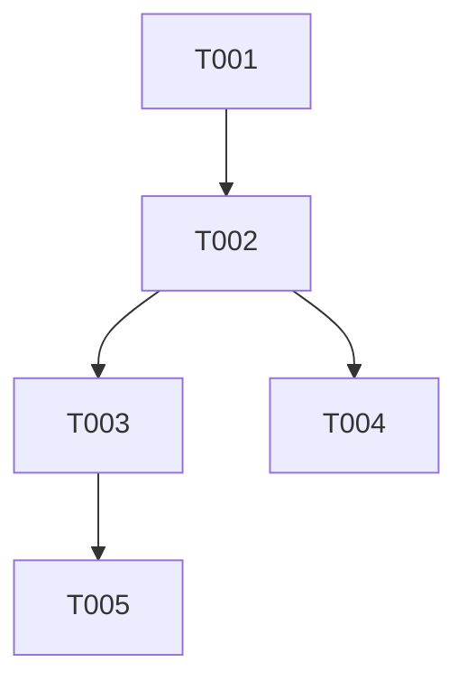

## Effort Summary

- Estimate range: ~3 weeks
- Tasks: 5 total - 5 MUST - 0 SHOULD - 0 COULD
- Sizes: 3xM - 2xS
- Minimum cut: Ship MUST-only -> ~12d

## Execution Overview

Implement persisted board commands first, then ordered event fanout, replay, and
archive behavior. Each task preserves authentication, authorization, input validation,
rate limit controls, audit logging, and secret redaction.

## Traceability Overview

| Source ID | Plan section | Harness tests | Task IDs | Completion evidence |
|---|---|---|---|---|
| FR-001 | API Design | test_create_card_emits_event | T-001 | create test passes |
| FR-002 | API Design | test_move_card_broadcasts_ordered_event | T-002 | realtime test passes |
| FR-003 | API Design | test_reconnect_replays_after_sequence | T-003 | replay test passes |
| FR-004 | API Design | test_archive_card_keeps_audit | T-004 | archive test passes |
| NFR-001 | Capacity Model | test_move_card_broadcasts_ordered_event | T-002 | latency evidence |
| SEC-001 | Security Architecture | test_cross_board_access_forbidden | T-001 | authz test passes |
| SEC-002 | Security Architecture | test_create_card_rejects_blank_title | T-001 | validation test passes |
| SEC-003 | Security Architecture | test_reconnect_rate_limit | T-003 | rate limit test passes |
| SEC-004 | Security Architecture | test_move_writes_audit_event | T-002 | audit test passes |
| SEC-005 | Security Architecture | test_realtime_payload_redacts_secret | T-005 | redaction test passes |

## Dependency Graph

## Task Sizing Legend

S means one focused day or less. M means one to three focused days with tests.

## Phase 1: Commands

### T-001: Create Cards With Board Authorization

**Spec refs:** FR-001, SEC-001, SEC-002
**Plan refs:** API Design, Security Architecture
**Harness refs:** tests/contract/test_cards.py::test_create_card_emits_event
**Priority:** MUST
**Estimate:** M

Create board and card command handlers with authentication, authorization, input
validation, audit logging, and secret-safe logs. Acceptance: pytest
test_create_card_emits_event and test_create_card_rejects_blank_title pass.

### T-002: Broadcast Ordered Card Move Events

**Spec refs:** FR-002, NFR-001, SEC-004
**Plan refs:** API Design, Architecture Overview
**Harness refs:** tests/e2e/test_realtime.py::test_move_card_broadcasts_ordered_event
**Priority:** MUST
**Estimate:** M

Persist move commands, allocate a sequence number, publish through Redis, and
write audit events. Acceptance: pytest test_move_card_broadcasts_ordered_event
and test_move_writes_audit_event pass.

### T-003: Implement Reconnect Replay And Rate Limit

**Spec refs:** FR-003, NFR-002, SEC-003
**Plan refs:** API Design, Capacity Model
**Harness refs:** tests/integration/test_replay.py::test_reconnect_replays_after_sequence
**Priority:** MUST
**Estimate:** M

Add replay queries after a supplied sequence and rate limit reconnect attempts.
Acceptance: pytest test_reconnect_replays_after_sequence and
test_reconnect_rate_limit pass.

### T-004: Archive Cards Without Losing Audit

**Spec refs:** FR-004, SEC-004
**Plan refs:** Data Model and Persistence
**Harness refs:** tests/contract/test_cards.py::test_archive_card_keeps_audit
**Priority:** MUST
**Estimate:** S

Archive cards with an audit event and keep history queryable. Acceptance: pytest
test_archive_card_keeps_audit passes.

### T-005: Redact Realtime Payloads

**Spec refs:** SEC-005
**Plan refs:** Security Architecture
**Harness refs:** tests/security/test_payloads.py::test_realtime_payload_redacts_secret
**Priority:** MUST
**Estimate:** S

Sanitize outgoing WebSocket payloads and diagnostics before delivery. Acceptance:
pytest test_realtime_payload_redacts_secret passes.
